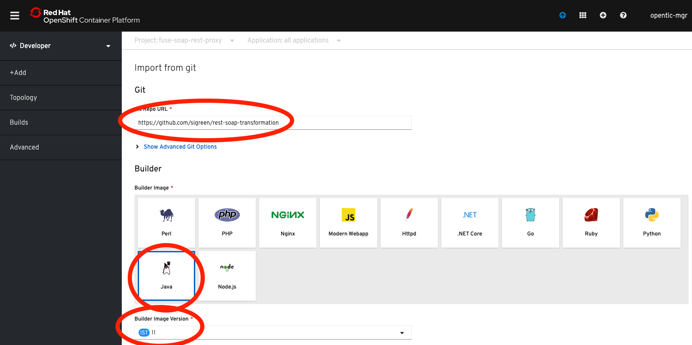
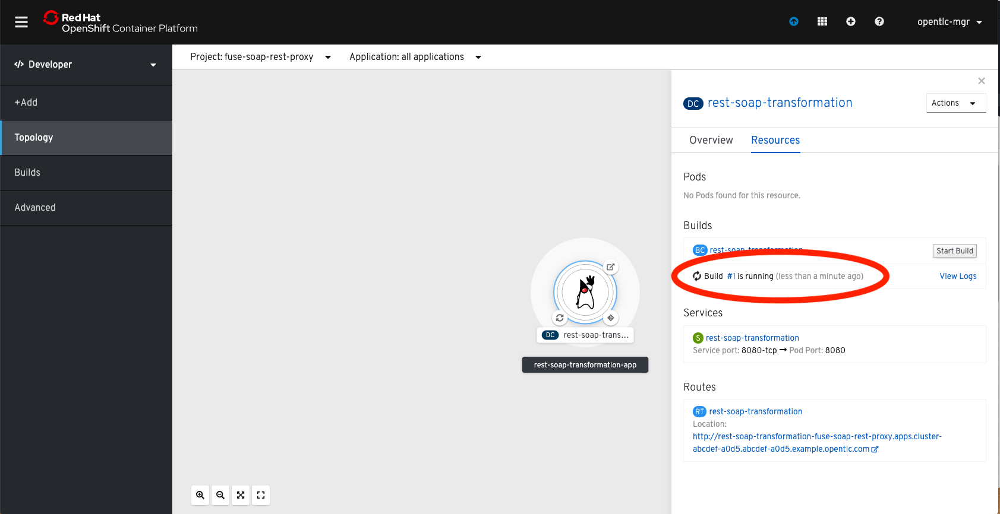
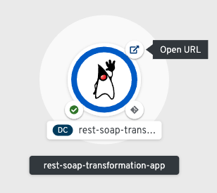
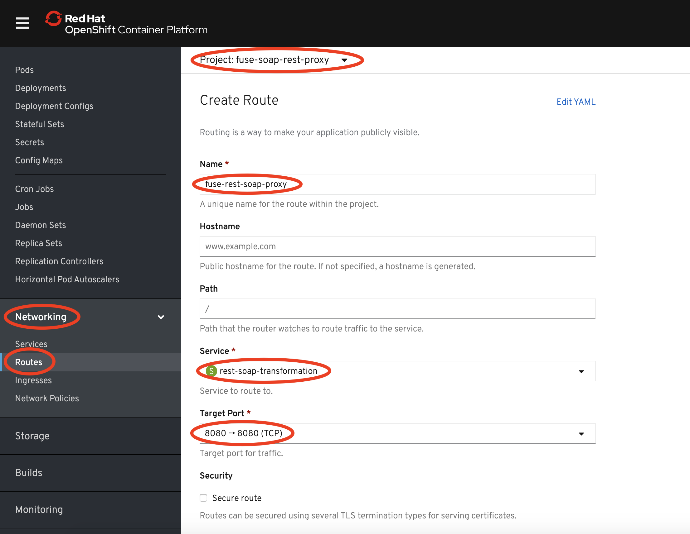
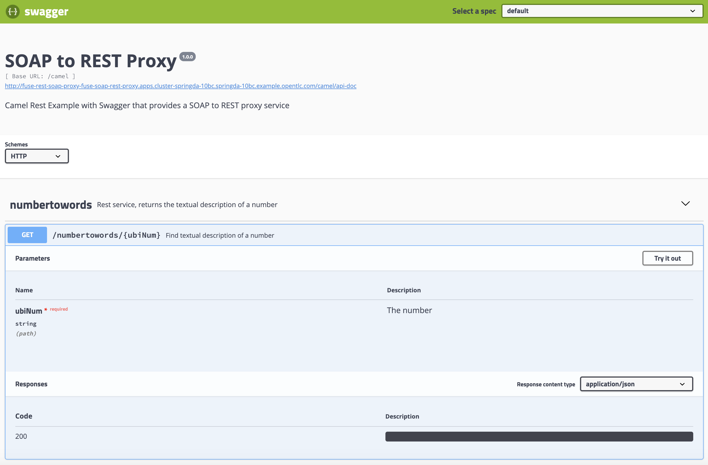

Fuse 7.4 SOAP to REST Proxy Demo on OpenShift 4.2
====================================

Demonstration of a SOAP to REST Proxy for an existing SOAP service, using the Fuse 7.4 image stream.  A video walkthrough demonstrating this project can be found [here](https://youtu.be/TLOLWMeobuU).

## Overview

This project demonstrates a microservices based project leveraging SpringBoot and Apache Camel to proxy an existing SOAP service with a new REST front-end service.  Additionally, the REST API is documented using Swagger / OpenAPI.  The project makes use of camel-servlet component listening on port 8080 and configured using SpringBoot.

## Prerequisites

An OpenShift 4.2 environment must be present for deployment to to a cloud environment.  For the purpose of testing, I prefer to use [Minishift](https://fabric8.io/guide/getStarted/minishift.html).  Unfortunately, OpenShift 4.x does not yet support SpringBoot 2, therefore we will stick with v1.5 for this project.

## Deployment

This project can be deployed using two methods:

* Standalone Spring-Boot container
* On an Openshift 4.2 environment using Fuse 7.4.

## Standalone Spring Boot Container

The standalone method takes advantage of the [Camel Spring Boot Plugin](http://camel.apache.org/spring-boot.html) to build and run the microservice.

Execute the following command from the root project directory:

```
mvn spring-boot:run -Dspring.profiles.active=dev
```

Once the spring boot service has started, you can test the REST API by navigating

```
curl -X GET "http://localhost:8080/camel/numbertowords/737373" -H "accept: application/json"
```

The number written in words is returned in JSON format.  Try other numbers as needed.

It's also possible to navigate the REST service using the Swagger / OpenAPI documentation [here](http://localhost:8080/swagger-ui.html).

## Openshift 4.x S2I Build / Deploy

The easiest method to deploy this example is to use the standard Openshift S2I build Method.

1. Login to the OpenShift Developer Web Console using your credentials.
2. Click on Project then *Create Project*.  Give the project name: `fuse-soap-rest-proxy` and description: `Fuse SOAP to REST Proxy Demo`.  Click **Create**.

3. On the Topology page, click *+Add* then *From Git*
4. In the *Git Repo URL* field, enter this repo URL: `https://github.com/sigreen/rest-soap-transformation`.  Select **Java** as the *Builder Image*, and **11** as the *Builder Image Version*.  Click on *Create*.

5. Give the build a couple of minutes to build and deploy. If you click on the blue circle, you should see under the *Resources* tab that build is running.

6.  Once the deployment has finished, click on the URL link and append the following to the URI: `/swagger-ui.html`.



## Openshift / Minishift Deployment (Fabric8 MVN Plugin)

First, create a new OpenShift project called *fuse-soap-rest-proxy*

```
oc new-project fuse-soap-rest-proxy --description="Fuse SOAP to REST Proxy Demo" --display-name="SOAP REST Proxy"
```

Execute the following command which will execute the *openshift* profile that executes the `clean fabric8:deploy` maven goal:

```
mvn -Popenshift
```

The fabric8 maven plugin will perform the following actions:

* Compiles and packages the Java artifact
* Creates the OpenShift API objects
* Starts a Source to Image (S2I) binary build using the previously packaged artifact
* Deploys the application using binary streams

## Create the OCP route

Once the container is deployed, open the OCP web UI and navigate to the *fuse-soap-rest-proxy* project.  Navigate to *Networking > Routes* the click *Create Route*.  Enter the details for the new route as shown below:



## Swagger UI

A [Swagger User Interface](http://swagger.io/swagger-ui/) is available within the rest-soap-transformation application to view and invoke the available services.  Click the above route location (link), and append `/swagger-ui.html` when the page opens.  This should display the below Swagger interface:



The raw swagger definition can also be found at the context path `/camel/api-doc`

## Command Line Testing

Using a command line, execute the following to query the definition service

```
curl -s http://$(oc get routes fuse-rest-soap-proxy --template='{{ .spec.host }}')/camel/numbertowords/737373 | python -m json.tool
```

A successful response will output the following

```json
{
    "item": "seven hundred and thirty seven thousand three hundred and seventy three "
}
```
